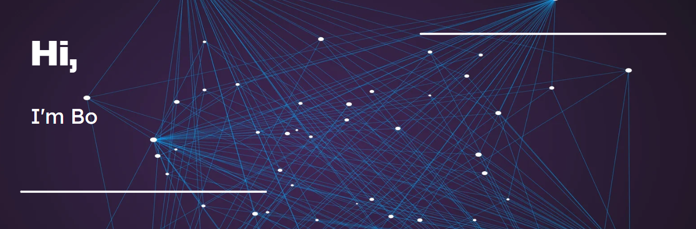

 
  

<h3 align="center">A professor, engineer, and author from California</h3>

- 🔭 I’m currently working on **learning new things.**

- 🌱 I’m currently learning **sailing.**

- 👯 I’m looking to collaborate on **machine learning and mechatronics.**

- 📝 I regularly write articles on **machine learning.**

## 💼 Languages and Tools
&nbsp;
&nbsp;
&nbsp;
&nbsp;
&nbsp;
&nbsp;
&nbsp;
&nbsp;
&nbsp;
&nbsp;
&nbsp;
 

## 📝 Latest Blog Posts

<!-- BLOG-POST-LIST:START -->
- [Test](https://liubo.org)
<!-- BLOG-POST-LIST:END -->
 

## &#x1f4c8; GitHub Stats

 

 

